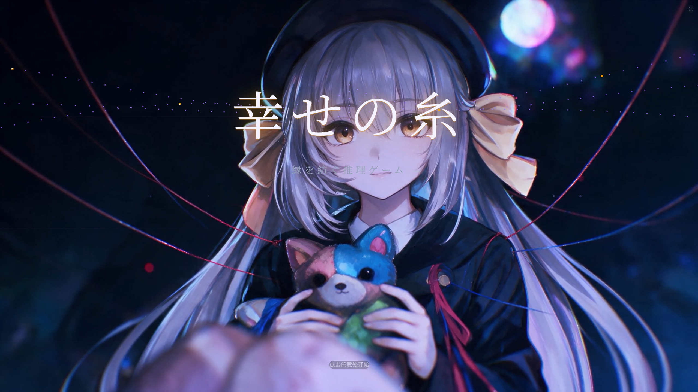
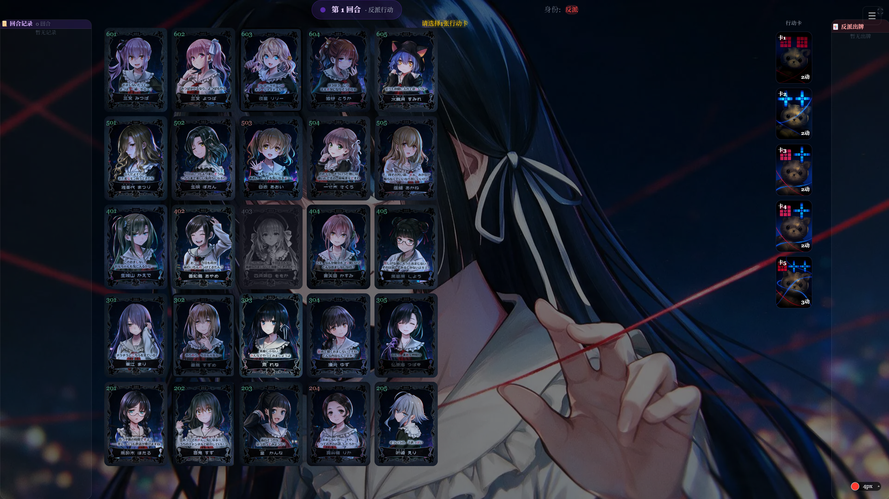

  

  

---

## 🖼️ Projects

  <table>
    <tr>
      <td align="center" width="50%">
        
         
        <b>幸せの糸 · 单人模式</b>
      </td>
      <td align="center" width="50%">
        
         
        <b>幸せの糸 · 联机对战</b>
      </td>
    </tr>
  </table>

---

## 🚀 About Me

- 🔭 Currently working on **an asymmetric deduction game「幸せの糸」(Shiawasenoito)**
- 🌱 Currently learning **AI Agents & Prompt Engineering**
- 👯 Looking to collaborate on **Game Development & AI Applications**
- 💬 Love discussing **game design and project architecture**
- 📫 Reach me: **[1937093115@qq.com](mailto:1937093115@qq.com)**

---

## 🛠️ Tech Stack

  
  
  
   
  
  
  
  
  
   
  
  
  
  
  

---

## 📊 GitHub Stats

  
  

  

---

## 🤝 Connect with Me

  
  

---

  <i>⭐️ Feel free to star my repositories if you find them interesting!</i>

